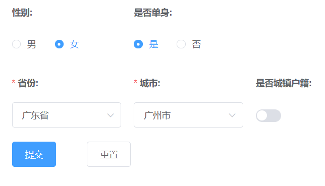

[github](https://github.com/Yeyanbin/yubi-form-template)

### 这是一个yubi-form [demo](https://yeyanbin.github.io/yubi-form-template/dist/#/form/index)

<div align="center">
  <span>
    
  </span>
  <span>
    
  </span>
  <span>
    
  </span>
  <span>
    
  </span>
  <span>
    
  </span>
</div>

对 Element ui的form组件进行二次封装。

> 是对配置化表单的一个小小的探索。

### 实现的目标
1. 在一个表单项变更时去关联另一个表单项
2. 一个较为灵活的布局
3. 将表单拆分为多个模块，自由的切换

### 介绍
组件：`/components/YubiForm` 
demo：`/views/form`, 两个表单配置文件

- 支持el-form的组件的属性，同时也支持将其变成方法来获取属性值。
  - [handleAttrs和handleFunc方法](https://github.com/Yeyanbin/yubi-form-template/blob/master/src/components/YubiForm/mixin.js#L40)
  - [封装的组件中使用](https://github.com/Yeyanbin/yubi-form-template/blob/85b03d8dc01c0cfaf1830085a786c34abc99bd9b/src/components/YubiForm/components/YubiRadios.js#L13)

```
// 例如下面的type属性
const submitButton = useButton('提交', 
  (vm, formConfig, formData) => {
    vm.$refs[formConfig.ref].validate((valid) => {
      if (valid) {
        // todo...
      }
    });
  }, 
  {
    span: 5,
    type: (vm, _, formData) => formData.status === 0? 'primary': 'warning',
  }
)
```

### Update

- 2021-5-12 增加了YubiForm对el-form封装时，增加了getFormData方法，增加了`Checkbox (未测试)`
  - 其筛选了一些被隐藏的选项
;
```
// 上面情况中，直接获取FormData可能会导致以下数据
{
  city_id: 0,
  gender: 1,
  hasChild: 1,
  isCityGuy: undefined,
  marriage: undefined,
  province_id: 0,
  single: 0,
  wantChild: 1,
}
// 而经过筛选的是下面的
{
  city_id: 0,
  gender: 1,
  province_id: 0,
  single: 0,
}
```
